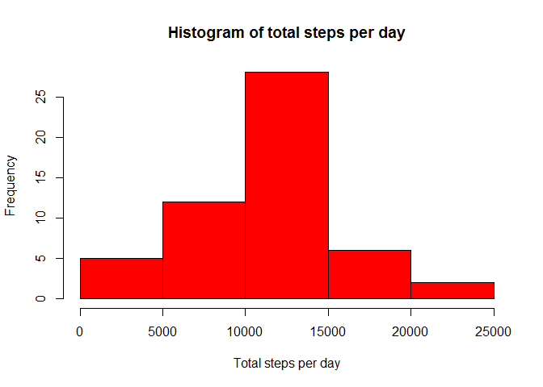
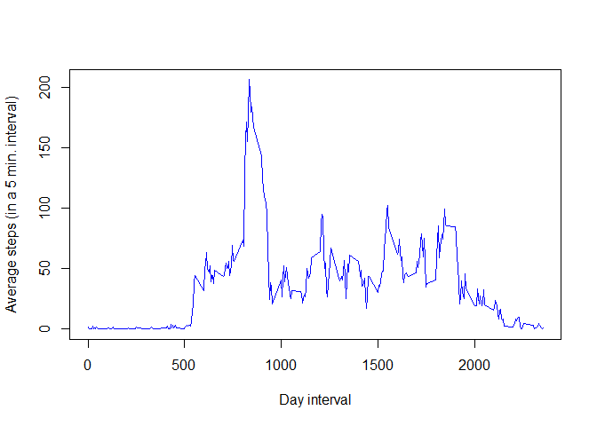
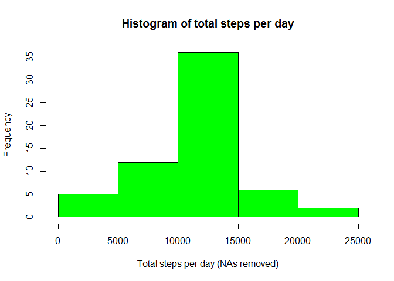
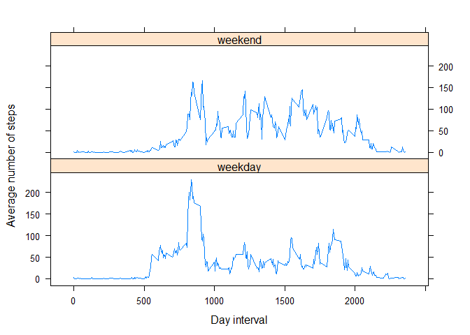

# Reproducible Research: Peer Assessment 1


## Loading and preprocessing the data
We start by loading the activity data from the archive as shown below

```r
act_data <- read.csv(unz("activity.zip", "activity.csv"));
```

## What is mean total number of steps taken per day?
We use package **dplyr** to extract a summary of the total steps per day.

```r
library(dplyr, quietly = TRUE, verbose = FALSE, warn.conflicts = FALSE)
act_summary <- act_data %>% group_by(date) %>% summarise(tot.steps = sum(steps));
```

Then we plot the total steps per day in a histogram

```r
hist(act_summary$tot.steps, 
     xlab = "Total steps per day", 
     ylab = "Frequency", 
     main = "Histogram of total steps per day",
     col  = "red");
```

<!-- -->

The **mean** total number of steps per day is equal to 

```r
mean(act_summary$tot.steps, na.rm = TRUE)
```

```
## [1] 10766.19
```

The **median** total number of steps per day is equal to

```r
median(act_summary$tot.steps, na.rm = TRUE)
```

```
## [1] 10765
```

## What is the average daily activity pattern?
We now study how the activity varies during the day on average. In order to do
so we aggregate the data by day interval 

```r
avg_by_interval <- act_data %>% group_by(interval) %>% summarise(avg.steps = mean(steps, na.rm = T));
```
Let's inspect the average activity during the day with a plot

```r
plot(avg_by_interval, type="l", col="blue", 
     xlab = "Day interval", ylab = "Average steps (in a 5 min. interval)");
```

<!-- -->

In order to discover on which interval there's the maximum activity in terms of number of steps
we apply the code below

```r
avg_by_interval[which.max(avg_by_interval$avg.steps),]
```

```
## Source: local data frame [1 x 2]
## 
##   interval avg.steps
##      (int)     (dbl)
## 1      835  206.1698
```
which should be around 8:20 in the morning.

## Imputing missing values
In the original dataset there a number of missing values equal to

```r
sum(is.na(act_data$steps))
```

```
## [1] 2304
```


on a total of 17568 records. 

We use the mean across all days over the 5 minute interval to fill in the missing data.
We then create a new dataset called **act_data_full** with the NAs filled in.

The code for doing this is shown below

```r
act_dictionary <- avg_by_interval$avg.steps;
names(act_dictionary) <- avg_by_interval$interval;
NA_entries <- is.na(act_data$steps);
steps_restored <- act_data$steps;
steps_restored[NA_entries] <- act_dictionary[as.character(act_data$interval[NA_entries])];
act_data_full <- act_data %>% 
                 mutate(steps_no_NA = steps_restored) %>% 
                 select(steps = steps_no_NA, date, interval);
```
To assess the impact of the missing values we repeat the histogram of the total number of steps per day

```r
act_summary_full <- act_data_full %>% group_by(date) %>% summarise(tot.steps = sum(steps));
hist(act_summary_full$tot.steps, 
     xlab = "Total steps per day (NAs removed)", 
     ylab = "Frequency", 
     main = "Histogram of total steps per day",
     col  = "green");
```

<!-- -->

The dataset without NAs has the following mean and median:

```r
mean(act_summary_full$tot.steps)
```

```
## [1] 10766.19
```

```r
median(act_summary_full$tot.steps)
```

```
## [1] 10766.19
```

which is not significantly different from the values calculated by ignoring the missing values.


## Are there differences in activity patterns between weekdays and weekends?

We classify the days as weekend or working day and we enhance the dataset **act_data_full** with this information.

```r
invisible(Sys.setlocale("LC_TIME", "C"));
wd_status <- weekdays(as.Date(act_data_full$date, "%Y-%m-%d"), abbreviate = T);
wd_status <- ifelse((wd_status == "Sun") | (wd_status == "Sat"), "weekend", "weekday");
act_data_full <- mutate(act_data_full, 
                        weekday.status = as.factor(wd_status));
```

We then compare the daily activity in the weekends with that of normal working days within the graph below

```r
library(lattice)
avg_steps_by_wd_status <- 
  summarise(group_by(act_data_full, interval, weekday.status), steps = mean(steps));
xyplot(steps ~ interval | weekday.status, data = avg_steps_by_wd_status, 
       type = "l", layout = c(1,2), xlab = "Day interval", ylab = "Average number of steps");
```

<!-- -->

